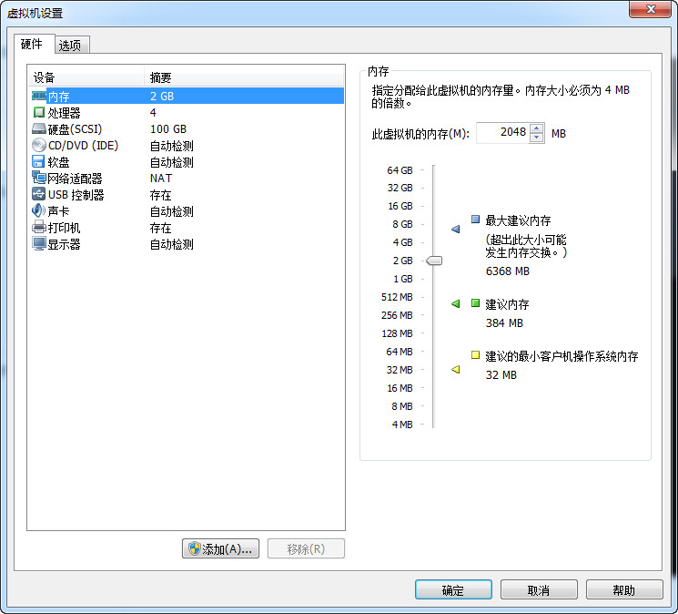

# 在VMware Workstation虚拟机中从ISO文件启动安装基本coreos #
## 一，准备 ##
1. VMware Workstations 11
2. ISO文件，[http://stable.release.core-os.net/amd64-usr/current/coreos_production_iso_image.iso](http://stable.release.core-os.net/amd64-usr/current/coreos_production_iso_image.iso "coreos ISO")
3. PuTTYgen，[http://the.earth.li/~sgtatham/putty/latest/x86/puttygen.exe](http://the.earth.li/~sgtatham/putty/latest/x86/puttygen.exe "puttygen") 
4. 代理服务器，内网IP：172.1.110.200

## 二，操作步骤 ##
1. 新建虚拟机，命名为：coreos。推荐配置如下：
 - 内存：2GB
 - 硬盘：100GB
 - 处理器核数：4
 - 网络连接模式：NAT
 - 如图：  
 
2. 从ISO文件启动虚拟机，完成初始化工作
3. 使用PuTTYgen制作ssh-key，并保存公钥和私钥
4. 新建文本文件命名为：cloud-config.yaml，文件内容如下：
	> \#cloud-config  
	> 
	> \# host name  
	> hostname: coreos  
	> \# /etc/hosts  
	> manage\_etc\_hosts: localhost
	> 
	> \# Add users to the system. Users are added after groups are added.  
	> users:     
	>　- name: root  
	>　　　　gecos: root  
	>　　　　homedir: /root  
	>　　　　primary-group: root  
	>　　　　groups:     
	>　　　　- root　　    
	>　　　　　shell: /bin/bash  
	>　- name: core  
	>　　　　gecos: core  
	>　　　　homedir: /home/core  
	>　　　　primary-group: core  
	>　　　　groups:   
	>　　　　　- core  
	>　　　　　- admin  
	>　　　　　- sudo  
	>　　　　ssh_authorized_keys:　　   
	>　　　　　- ssh-rsa AAAAB3NzaC1yc2EAAAADAQABAAABAQDr0GXoActX83**......**  
	>　　　　shell: /bin/bash
	> 
	> \# write files  
	> write_files:  
	>　- path: /etc/resolv.conf  
	>　　　　permissions: 0644  
	>　　　　owner: root  
	>　　　　content: |  
	>　　　　　　nameserver 8.8.8.8  
	>　- path: /etc/ssh/sshd_config  
	>　　　　content: |  
	>　　　　　　Port 22  
	>　　　　　　Protocol 2  
	>　　　　　　UsePrivilegeSeparation yes  
	>　　　　　　KeyRegenerationInterval 3600  
	>　　　　　　ServerKeyBits 1024  
	>　　　　　　SyslogFacility AUTH  
	>　　　　　　LogLevel INFO  
	>　　　　　　LoginGraceTime 120  
	>　　　　　　PermitRootLogin yes  
	>　　　　　　StrictModes yes  
	>　　　　　　RSAAuthentication yes  
	>　　　　　　PubkeyAuthentication yes  
	>　　　　　　IgnoreRhosts yes  
	>　　　　　　RhostsRSAAuthentication no  
	>　　　　　　HostbasedAuthentication no  
	>　　　　　　PermitEmptyPasswords yes  
	>　　　　　　ChallengeResponseAuthentication no  
	>　　　　　 X11Forwarding yes  
	>　　　　　　X11DisplayOffset 10  
	>　　　　　　PrintMotd no  
	>　　　　　　PrintLastLog yes  
	>　　　　　　TCPKeepAlive yes  
	>　　　　　　AcceptEnv LANG LC_*  
	>　　　　　　UsePAM yes　　　　　　　
	
5. 上传cloud-config.yaml文件到代理服务器(172.1.110.200)，其中ssh_authorized_keys为PuTTYgen制作的公钥文件内容。
6. 拷贝cloud-config.yaml文件到虚拟机coreos  
	`scp user@172.1.110.200:/home/user/cloud-config.yaml .`
7. 进入root用户  
    `sudo su`
8. 安装coreos  
    `coreos-install -d /dev/sda -C stable -c cloud-config.yaml`
9. ssh登录安装后的coreos  
    `ssh -i id_rsa xx.xx.xx.xx -l core`
10. 到此一个最基本的coreos系统环境安装完成。
    
## 三，问题 ##
1. 网络下载速度慢
    - 在安装之前从[http://stable.release.core-os.net/amd64-usr/current/](http://stable.release.core-os.net/amd64-usr/current/ "coreos所有安装包")下载如下文件：  

        > coreos_production_image.bin.bz2  
        > coreos_production_image.bin.bz2.DIGESTS  
        > coreos_production_image.bin.bz2.DIGESTS.asc  
        > coreos_production_image.bin.bz2.DIGESTS.sig   
        > coreos_production_image.bin.bz2.sig  
        > coreos_production_image_contents.txt  
        > coreos_production_image_contents.txt.sig  
        > coreos_production_image_packages.txt  
        > coreos_production_image_packages.txt.sig
    - 将下载的上述文件上传到代理服务器(172.1.110.200)，Apache根目录：  
       `/var/www/html/current`  
    - 启动Apache服务：  
       `service httpd start`
    - 回到虚拟机coreos，执行如下安装命令：  
       `coreos-install -d /dev/sda -C stable -c cloud-config.yaml -V stable -b http://172.1.110.200`
2. 安装后无法登录
    - 检查cloud-config.yaml文件中ssh_authorized_keys是否为正确的公钥内容，形如：
      `ssh-rsa AAAAB3NzaC1yc2EAAAADAQABAAABAQDr0GXoActX838nY8XR3AAGpMeeOrvzZK1GKtiXBdUazyhXFb0qscXiXNn6SrL...`